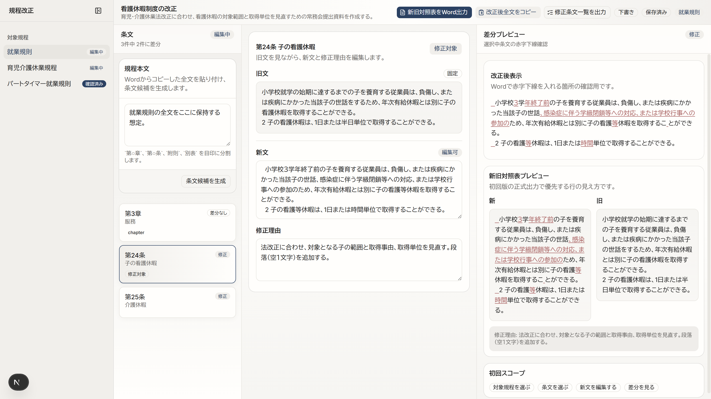
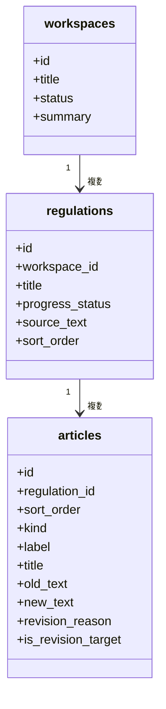
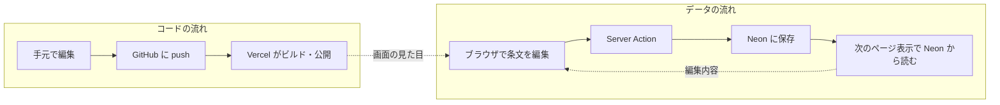
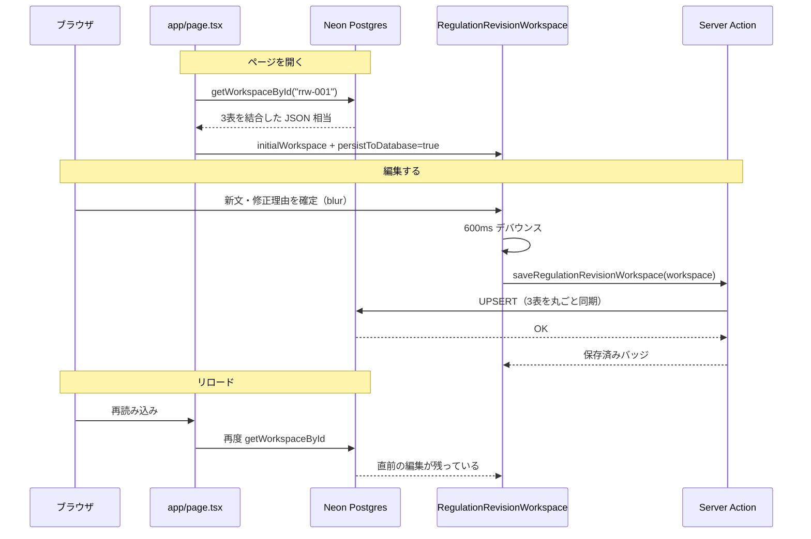

# 規程改正ワークスペースに「記憶」を持たせる — 図解

この図解は、規程改正ワークスペースが **編集内容をどこに・なぜ保存するか** を整理したものである。

画面の作業フロー（4ペイン・差分・出力）は [`regulation-revision-visual-explainer.md`](regulation-revision-visual-explainer.md) を見る。
ここでは **永続化（記憶）** だけを扱う。

HTML 版（クラス向け・スクリーンショット付き）: `personal-visual-explainers/output/regulation-revision-memory-peer/`（公開 URL: https://diagram-regulation-revision-memory.surge.sh）

## 1. ゴール

「動いた」だけで終わらせず、次の3つを自分の言葉で説明できる状態にする。

- **何を** 保存したか（データの中身）
- **どこに** 保存したか（保存先）
- **なぜ** その保存先を選んだか（他の選択肢と比べた理由）

## 2. 結論とナゼか

**編集データは Neon（Postgres）に置く。**

### ナゼか？

条文の編集内容は **「動いているアプリのデータ」**。ブラウザを閉じても残る場所が必要だった。

| # | 理由 |
|---|---|
| **1** | **リロードしても消えない** — ブラウザのメモ（localStorage）だとその PC だけ。Neon ならサーバーに残る |
| **2** | **手元と公開 URL で同じ中身を見られる** — localhost も Vercel も、同じ Neon を読む。編集が共有される |
| **3** | **画面の構造 = 3表で説明しやすい** — 案件・規程・条文の入れ子を、そのまま Postgres の表に落とせる |

### 覚えておく — コード（GitHub）とは別物

GitHub にはアプリのソース（React / Next.js）だけを置く。**push しても条文の編集内容は GitHub には載らない**（載せない設計）。混同すると「保存したのに push したら反映される？」と誤解しやすい。

## 3. ツールの画面

規程改正ワークスペースの実際の画面（就業規則・第24条）。ヘッダー右の「保存済み」が Neon への自動保存成功の合図。

| 画面の場所 | 記憶との関係 |
|---|---|
| ヘッダー「保存済み」 | Neon への自動保存が成功した合図 |
| Pane 1 対象規程 | `regulations` 表の一覧 |
| Pane 2 条文リスト | `articles` 表の一覧 |
| Pane 3 旧文・新文・修正理由 | 編集確定後、600ms デバウンスで Neon へ保存 |
| Pane 4 差分プレビュー | **保存しない**（旧文と新文からその場で計算） |

手元: `http://localhost:3000` / 公開: `https://regulation-revision-workspace.vercel.app`

## 4. 保持できるようにしたデータ

画面の入れ子を、そのまま **Postgres の3表** に落とした（案A）。

### 表ごとに何を置くか

| 表 | 画面での例 | 保存する項目 |
|---|---|---|
| `workspaces` | 「看護休暇制度の改正」 | 案件名、ステータス、概要 |
| `regulations` | 「就業規則」「育児介護休業規程」 | 規程名、進捗、貼り付け元全文 |
| `articles` | 「第24条 子の看護休暇」 | 条番号・見出し、旧文、新文、修正理由、修正対象フラグ |

### あえて保存しないもの

| データ | 理由 |
|---|---|
| 差分あり / 変更種別 | 旧文と新文を比較すれば毎回計算できる |
| 赤字下線プレビュー | 同上。表示専用の派生データ |
| 選択中の規程・条文 ID | その場の UI 状態。リロード後は先頭や修正対象にフォールバック |
| 編集履歴（いつ誰が直したか） | 将来の案D。今回はスコープ外 |

**設計の芯**: 正本は「旧文・新文・修正理由」だけ持ち、見た目の差分は都度計算する。

## 5. 保存先の詳細（Neon）

| 項目 | 内容 |
|---|---|
| **保存先** | [Neon](https://neon.tech/) 上の Postgres データベース |
| **接続** | 環境変数 `DATABASE_URL`（Vercel Storage 連携で注入） |
| **読み書き** | `lib/regulation-revision/db/` → Server Action → 画面 |

### 今回は選ばなかった保存先

| 保存先 | たとえ | 今回の判断 |
|---|---|---|
| **localStorage** | その PC の付箋 | 不採用。端末を変えると消える |
| **JSON（リポジトリ内）** | 付属の見本データ | 初期投入・DB 未接続時のフォールバックのみ |
| **GitHub** | 原稿の倉庫 | **コード用**（条文データの正本ではない） |

### GitHub / Vercel / Neon は別物

混同すると「コードを直したのにデータが変わらない」「保存したのにリロードで戻る」が起きる。

| 名前 | 役割 | このプロジェクトでの中身 |
|---|---|---|
| **GitHub** | コードの履歴 | React / Next.js のソース |
| **Vercel** | 公開とホスティング | `regulation-revision-workspace.vercel.app` |
| **Neon** | データの正本 | workspaces / regulations / articles の3表 |

## 6. 読み書きの流れ

### 実装の要点

| ファイル | 役割 |
|---|---|
| `app/page.tsx` | 起動時に Neon から読む。`dynamic = "force-dynamic"` で静的化を避ける |
| `app/actions/regulation-revision.ts` | クライアントから呼ぶ保存入口 |
| `lib/regulation-revision/db/repository.ts` | SELECT / UPSERT の具体処理 |
| `lib/regulation-revision/db/schema.sql` | 3表の定義 |
| `data/regulation-revision-workspace.json` | Neon に接続できないときの見本 |

**`force-dynamic` を付けた理由**: ページを静的化すると、ビルド時点の JSON が返り、Neon に保存してもリロードで古い内容に戻ってしまうため。

## 7. 作ってみてどう感じたか

作業ガイドの5ステップ（①保存先決定 → ②箱用意 → ③仕組み → ④手元確認 → ⑤公開確認）を通して得た感想である。

### うまくいったこと

- **画面の入れ子 = 3表** にすると、DB の説明がそのまま画面の説明になる
- Vercel の Storage から Neon を足すと、`DATABASE_URL` が環境変数に載り、手元は `.env.local` に同じ値を写すだけでよかった
- 自動保存 + 「保存済み」バッジで、保存の有無が目に見えた
- 手元と公開 URL の両方でリロード確認でき、「記憶が付いた」実感が得られた

### 苦戦したこと・工夫したこと

| 出来事 | 対処・学び |
|---|---|
| Vercel Hobby で鍵付き GitHub リポジトリのデプロイがブロックされた | リポジトリを Public にし、Vercel プロジェクトを作り直して Ready にした |
| 保存したのにリロードで元に戻る | ページが静的生成されていた。`force-dynamic` で毎回 Neon から読むようにした |
| GitHub / Vercel / Neon の役割が混ざる | 「コードの倉庫」「公開の店」「データのキャビネット」のたとえで整理した |
| 環境変数が `DATABASE_URL` と `PGHOST` など複数並ぶ | アプリが使うのは `DATABASE_URL` だけ、と決めて他は触らない |
| 条文候補の再生成で編集が消える | 確認ダイアログを入れ、誤操作を防いだ |
| 保存のタイミング | キー入力のたびに DB へ飛ばさず、600ms デバウンスでまとめて保存 |

### もっとやりたかったこと（今回は見送り）

- **編集履歴表（案D）**: 誰がいつどの条文を直したか。監査・巻き戻し用
- **複数改正案件**: 今は `rrw-001` 固定。案件を増やす UI
- **規程・条文の追加・削除**: データモデルは対応済みだが、画面操作は後回し
- **保存失敗時のユーザー向け表示**: 現状はコンソール + バッジ。トースト等で分かりやすくしたい
- **オフライン編集**: 未対応。Neon 必須のオンライン前提

## 8. 自分用チェックリスト（説明の練習）

人に説明するとき、次を順に言えるか確認する。

1. 規程改正の **編集データ** は Neon の Postgres に置いている
2. **3表**（workspaces / regulations / articles）が、画面の案件・規程・条文に対応する
3. **差分や赤字下線は保存しない**。旧文と新文から計算する
4. **GitHub はコード**、**Neon はデータ**（別枠で覚える）
5. **localStorage ではない**。端末を変えても、公開 URL から開いても、同じ Neon を見る
6. ページは **`force-dynamic`**。静的化すると保存が反映されない

## 9. 関連ドキュメント

| ドキュメント | 内容 |
|---|---|
| [`regulation-revision-workspace-guide.md`](regulation-revision-workspace-guide.md) | 開き方・GitHub / Vercel / Neon 手順・5ステップの記録 |
| [`regulation-revision-workspace-notes.md`](regulation-revision-workspace-notes.md) | 設計判断の正本（ペイン責務・データモデル） |
| [`regulation-revision-visual-explainer.md`](regulation-revision-visual-explainer.md) | 4ペイン・差分・出力の図解（記憶以外） |
