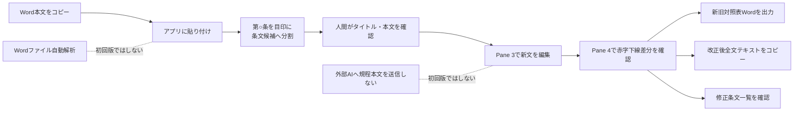
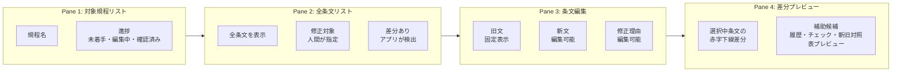
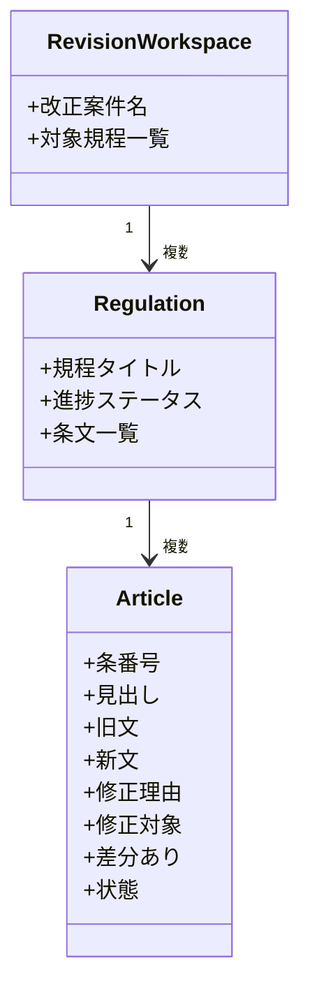
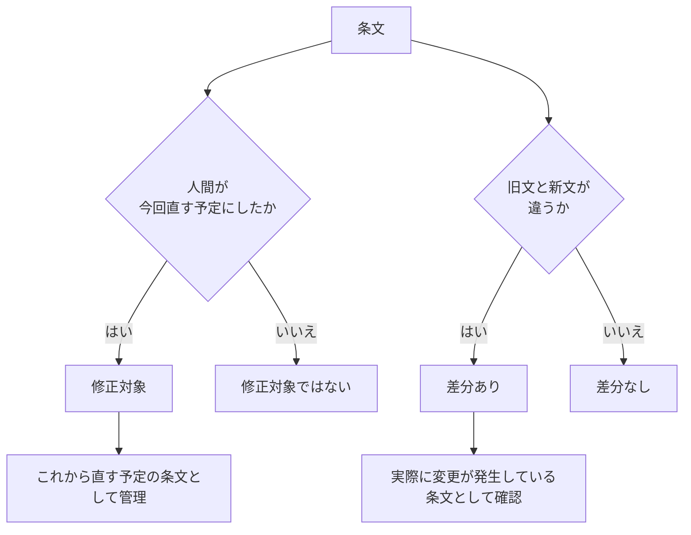
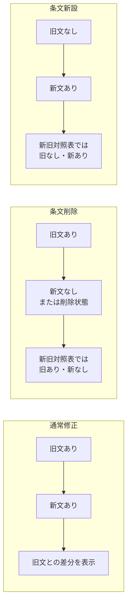
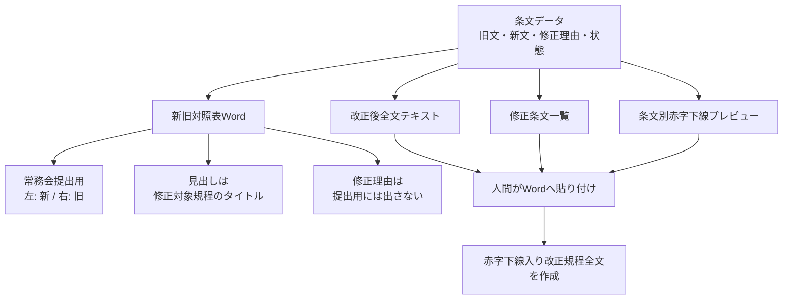
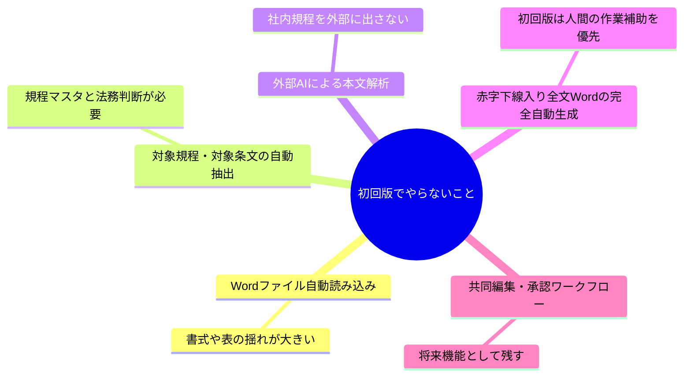
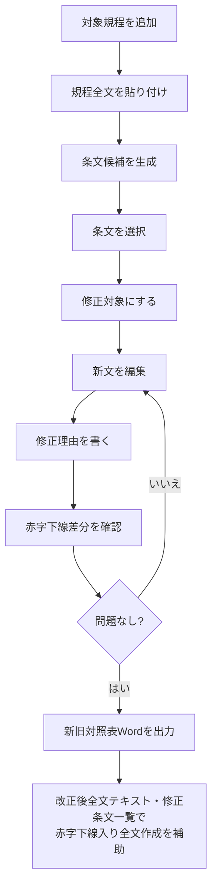

# 規程改正ワークスペース 図解

この図解は、`regulation-revision-workspace-notes.md` で固めた初回版の方針を、画面・データ・出力の流れとして整理したもの。

## 1. 全体像

初回版では、外部AIによる自動解析やWord自動読み込みは行わない。
人間が規程本文を貼り付け、アプリが条文候補へ分割し、人間が新文を編集する。

## 2. 4ペインの役割

作業の中心は、Pane 3 の新文編集と Pane 4 の赤字下線差分プレビュー。
Pane 1 と Pane 2 は、対象規程と条文を選ぶためのナビゲーションとして使う。

## 3. 条文データの考え方

条文は、旧文と新文を分けて持つ。
旧文は正本として固定し、新文だけを編集することで、新旧対照表と差分プレビューを安定して作れるようにする。

## 4. 「修正対象」と「差分あり」の違い

`修正対象` は人間が付ける予定管理の印。
`差分あり` はアプリが旧文と新文の違いから検出する状態。

## 5. 通常修正・削除・新設の扱い

条文削除や新設でも、旧文と新文の関係を保つ。
条番号の繰り上げや新設番号の調整は、初回版ではアプリが自動で振り直さず、人間が新文側で編集する。

## 6. 出力の優先順位

初回版の正式なWord出力は、新旧対照表を優先する。
赤字下線入り改正規程全文は最終的に必要だが、初回版では完全自動生成ではなく、人間がWordで作りやすい補助を用意する。

## 7. 初回版でやらないこと

## 8. まず作るべき初回操作フロー

